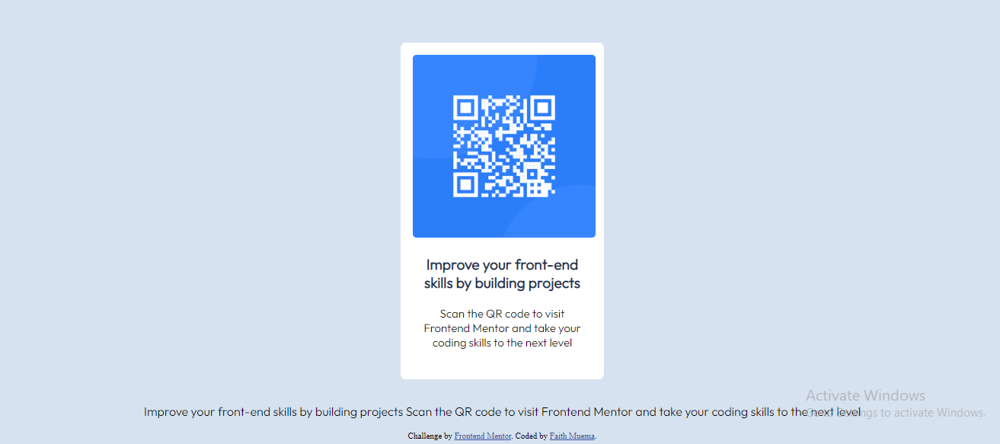

# Frontend Mentor - QR code component solution

This is a solution to the [QR code component challenge on Frontend Mentor](https://www.frontendmentor.io/challenges/qr-code-component-iux_sIO_H). Frontend Mentor challenges help you improve your coding skills by building realistic projects. 

## Table of contents

  - [Screenshot](#screenshot)
  - [Links](#links)
- [My process](#my-process)
  - [Built with](#built-with)
  - [What I learned](#what-i-learned)
  - [Continued development](#continued-development)
  - [Useful resources](#useful-resources)
- [Author](#author)

### Screenshot

### Links

- Solution URL: [Add solution URL here](https://your-solution-url.com)

### Built with

- Semantic HTML5 markup
- CSS custom properties

### What I learned

:root{
    --bk-groundcolor: hsl(0, 0%, 100%);
    --bk-gr: hsl(212, 45%, 89%);
    --text: hsl(220, 15%, 55%);
    --color3: hsl(218, 44%, 22%);
    --font-size: 15px;
    --weight: 400;
    --weight2: 700;
    --font-family: 'Outfit', sans-serif;
}

### Continued development

responsiveness of the website. Learning more about css

### Useful resources

- [resource 1](https://www.w3schools.com/) - This helped me for css design. 

## Author

- Website - [Add your name here](https://faith-muema.netlify.app/)
- Frontend Mentor - [@yourusername](https://www.frontendmentor.io/profile/fay-muema)

